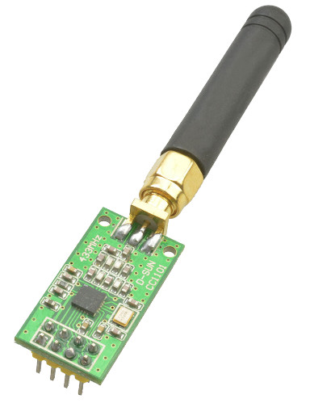

### Serial over CC1101

This project uses an AVR and TI's CC1101 to create an over-the-air serial bridge.

  * Uses an ATmega88 @ 8MHz. To use another CPU and/or frequency (e.g. an Arduino), modify the makefile.
  * The default values for CC1101 registers (main.c: cc_RFSETTINGS) are for 433.92MHz. To use another frequency and/or config, use TI's SmartRF Studio.
  * Baudrate is 9600. Increasing baudrate requires different CC1101 configuration.
  * AVR and CC1101 talk exclusively over SPI (PB2-5). No other pins (GDOn) are used.

